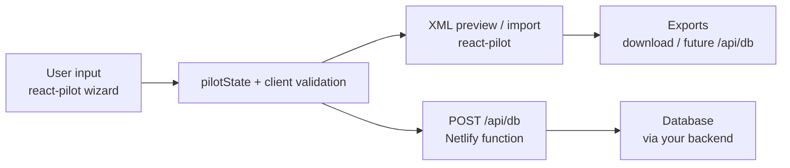
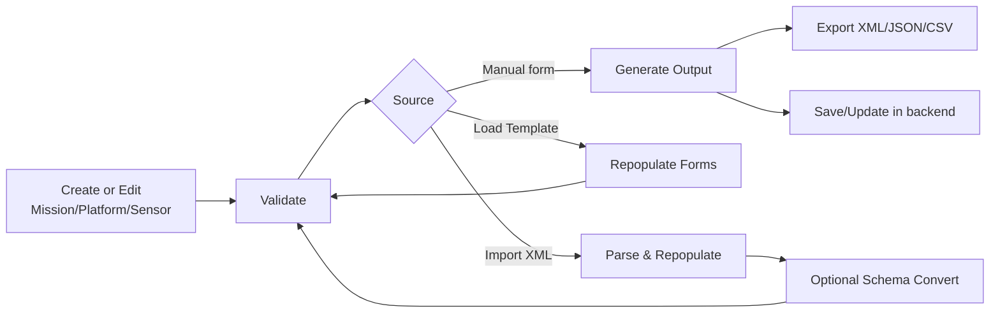

# UxS Metadata Generator

A **web application** (React pilot + HTTP API) that automates metadata creation for Uncrewed Systems (UxS) missions, including AUVs, UUVs, USVs, and UAS. The canonical UI lives in **`react-pilot/`** and talks to persistence through **`/api/db`** (see [react-pilot/docs/DEPLOYMENT.md](react-pilot/docs/DEPLOYMENT.md)).

## Why this tool exists

Creating mission metadata manually is often slow, error-prone, and dependent on XML expertise. The UxS Metadata Generator removes that bottleneck by guiding users through structured forms and generating standards-compliant outputs automatically.

## What it does

- Generates machine-readable, interoperable metadata records
- Targets ISO 19115-2 and supports ISO 19115-2 compatibility/conversion
- Provides real-time validation to reduce submission errors
- Supports output workflows for XML, JSON, and CSV
- Integrates with your backend for persistent storage (e.g. Netlify `/api/db`)
- Includes offline-capable browser persistence (IndexedDB support in v2.0.0 documentation)

## Application workflow

The **production UI** is the **React pilot** (`react-pilot/`) — a six-step wizard (Mission → Platform → Sensors → **Spatial** → Keywords → Distribution). Classic **`Index.html`** five-step flow remains in the repo as a **reference** implementation alongside root `*.gs` XML utilities.

## Standards and schema support

- **Primary (NCEI / Navy-style records in this repo):** ISO 19115-2 with root **`gmi:MI_Metadata`** and `gmd` / `gco` / `gmi` constructs (see `SchemaValidator.gs` → `UniversalXMLGenerator` and `OVERVIEW_TEMPLATE_ALIGNMENT.csv`).
- **Older / alternate encodings:** Some documentation still refers to abstract ISO 19115-3-style `mdb:MD_Metadata` paths for illustration; treat **`METADATA_FIELD_MAP.md`** and the generator code as the source of truth for what this deployment emits.
- Schema conversion and mapping logic live in **`SchemaValidator.gs`** (generator, parser, schema support).

## Repository layout and alignment docs

| Artifact | Role |
|----------|------|
| [METADATA_FIELD_MAP.md](METADATA_FIELD_MAP.md) | Excel / legacy form `name` ↔ JSON ↔ generator paths; **§7** = React pilot field matrix. |
| [OVERVIEW_TEMPLATE_ALIGNMENT.csv](OVERVIEW_TEMPLATE_ALIGNMENT.csv) | High-level XML section vs generator alignment (Partial / Aligned / etc.). |
| [NOAA_UXS_MIGRATION_TRACKER.csv](NOAA_UXS_MIGRATION_TRACKER.csv) | Program workstreams and status (accessibility, backend, security, delivery). |
| [PRODUCTION_QA_RUNBOOK.md](PRODUCTION_QA_RUNBOOK.md) | QA runbook (includes **historical** classic-web T01–T12 + static **Appendix A**). |
| [PILOT_SHARE_WORKFLOW.md](PILOT_SHARE_WORKFLOW.md) | Build and share the static **React pilot** (`pilot-share/`). |
| [react-pilot/README.md](react-pilot/README.md) | React app: Vite dev, HTTP host bridge, publish. |
| [react-pilot/docs/DEPLOYMENT.md](react-pilot/docs/DEPLOYMENT.md) | **Netlify / `/api/db`**. |

**Root `*.gs` + HTML:** legacy generator and classic wizard (`SchemaValidator.gs`, `Index.html`, …) — useful for **XML/schema parity** with `METADATA_FIELD_MAP.md` and `OVERVIEW_TEMPLATE_ALIGNMENT.csv`.  
**React pilot:** `react-pilot/` — **canonical** UI and `pilotState`.

## Static pilot bundle (`pilot-share/`)

From repo root, `npm --prefix react-pilot run publish` (or **`npm run pilot:publish`** if you use the root [package.json](package.json)) builds the pilot and copies **`react-pilot/dist`** to **`pilot-share/`** for HTTP preview or packaging. See [PILOT_SHARE_WORKFLOW.md](PILOT_SHARE_WORKFLOW.md). Local sanity checks that mirror README “review” goals (not a substitute for production host QA) are listed there and in the runbook **Appendix A** for the static bundle.

**Hot reload while coding:** from repo root run **`npm run pilot:dev`** (Vite on **http://localhost:5173** by default, with HMR). Use **`pilot:publish`** when you want the same build copied into `pilot-share/` for the static server (e.g. port 4173).

**Fast verification from root:** run **`npm run pilot:verify`** to execute the React pilot verification chain (`lint` + `build` + XML roundtrip/fixture checks).

## Mission field map (core example)

These fields are central to mission metadata capture and generation. Representative XML paths use **`gmd` / `gmi`** naming as in the Navy/NCEI-style template (see `OVERVIEW_TEMPLATE_ALIGNMENT.csv`).

| Field | Requirement | Representative path (19115-2 style) |
|---|---|---|
| File / metadata identifier | Required | `gmd:fileIdentifier` |
| Mission title | Required | `gmd:identificationInfo/.../gmd:citation/gmd:CI_Citation/gmd:title` |
| Creation / acquisition start | Required* | Citation `gmd:date` (creation) + temporal extent |
| Abstract | Required | `gmd:identificationInfo/.../gmd:abstract` |
| Contact organization | Required | Responsible party `gmd:organisationName` |
| Alternate title | Optional | `gmd:citation/.../gmd:alternateTitle` |
| Publication date | Optional | `gmd:citation/.../gmd:date` (type = publication) |
| Contact email | Required | `gmd:electronicMailAddress` (metadata or dataset contact) |

\* Creation date is currently sourced from mission start date in generation flow.

## Tech stack

- **Production UI:** React 19 + Vite (`react-pilot/`), hosted on Netlify (or any static + API host).
- **Persistence API:** `POST /api/db` (see [react-pilot/docs/DEPLOYMENT.md](react-pilot/docs/DEPLOYMENT.md)).
- **Reference / XML engine:** root `*.gs` modules and classic HTML (`Index.html`, …) remain in-repo for generator parity.

## Key files

- **`react-pilot/`** — canonical wizard, `pilotState`, XML preview/import, HTTP host adapter.
- [SchemaValidator.gs](SchemaValidator.gs): ISO 19115-2 XML generation (`UniversalXMLGenerator`) and parsing/validation (reference implementation).
- [ValidationSystem.gs](ValidationSystem.gs): Validation rule engine (reference for server rules).
- [Index.html](Index.html) / [Scripts.html](Scripts.html): classic HTML wizard (reference; was historically deployed with Google Apps Script — no longer maintained in this repo).

## Setup and deployment

**Primary (React + HTTP):** see [react-pilot/README.md](react-pilot/README.md) and [react-pilot/docs/DEPLOYMENT.md](react-pilot/docs/DEPLOYMENT.md). Use `npm run pilot:dev` with **`netlify dev`** so `/api/db` exists during local work.

## Add and update guide

### Add or update platform records

- Use **Step 2: Platform Information**.
- Enter a unique `Platform ID` to add a new record.
- Reuse an existing `Platform ID` to update an existing record.
- Save actions persist through your configured backend (e.g. Postgres via `/api/db`).

### Add or update sensor records

- Use **Step 3: Sensor Configuration**.
- Add sensor cards by type, then fill required fields.
- Save to persist sensor definitions through your configured backend.
- Load and edit existing sensors as needed.

### Add or update reusable templates

- Configure all relevant fields across Steps 1–5.
- Save as template from the Templates controls.
- Load template to update and re-save.

### Import/update from XML

- Use **Import XML** to parse and repopulate forms.
- Select target schema and use **Convert to Selected Schema** for cross-standard updates.
- Regenerate outputs after review and validation.

## Validation behavior

Validation is available at different levels and runs before generation/export to reduce schema and content errors. Current QA notes and recent fixes are tracked in [CHANGELOG.md](CHANGELOG.md). **Deployed app** QA: your production host checklist plus [PRODUCTION_QA_RUNBOOK.md](PRODUCTION_QA_RUNBOOK.md) (includes **historical** classic-web T01–T12). **Static `pilot-share/`** smoke checks: **Appendix A** in that runbook.

## Version notes

- Documented release: **v2.0.0** (June 2025), including IndexedDB offline support and enhanced XML validation.
- Additional fixes and hardening updates continue in [CHANGELOG.md](CHANGELOG.md).

## Troubleshooting

- If data is not persisting, verify `/api/db` responses (Netlify logs) and database connectivity.
- If schema conversion fails, inspect mapping and conversion logs in `SchemaSupport` (`SchemaValidator.gs`).
- If validation blocks generation, check required mission/contact fields first.

## Developer notes

### Architecture (data flow)

### Add/update lifecycle

### Runtime entry points

- **Production UI + API:** Vite app in [react-pilot/](react-pilot/) and `POST /api/db` (see [react-pilot/docs/DEPLOYMENT.md](react-pilot/docs/DEPLOYMENT.md)).
- **Classic HTML (reference only):** [Index.html](Index.html) + `<?!= include('…') ?>` templates — parity reference; spreadsheet-backed Apps Script entry was removed from this repo.
- **XML generation path:** `generateXML` / `generateXMLWithSchema` → `UniversalXMLGenerator` in [SchemaValidator.gs](SchemaValidator.gs)
- **Validation path:** rule definitions and execution in [ValidationSystem.gs](ValidationSystem.gs)
- **Schema conversion path:** conversion + mappings in `SchemaSupport` (`SchemaValidator.gs`)

### Maintenance checklist (add/update changes)

When adding or updating fields, keep these layers in sync:

1. **UI fields** in [Index.html](Index.html) (input `name` / IDs, labels, required markers).
2. **Client data collection/binding** in [Scripts.html](Scripts.html) (collect/populate/reset/step validation).
3. **Persistence** via [react-pilot/netlify/functions/db.mjs](react-pilot/netlify/functions/db.mjs) (`POST /api/db`) or your host’s equivalent — not Google Sheets in this repo.
4. **XML emitters/parsers** in `SchemaValidator.gs` (`UniversalXMLGenerator`, `UniversalXMLParser`).
5. **Validation rules** in [ValidationSystem.gs](ValidationSystem.gs) for required/format logic.
6. **Regression checks** using [PRODUCTION_QA_RUNBOOK.md](PRODUCTION_QA_RUNBOOK.md) on a **deployed** web app.
7. **React pilot parity (optional but recommended for migration):** update `react-pilot/src` state + steps + `pilotValidation.js` / `xmlPreviewBuilder.js`, refresh **`METADATA_FIELD_MAP.md` §7**, and run `npm --prefix react-pilot run publish` so `pilot-share/` stays reviewable alongside **OVERVIEW_TEMPLATE_ALIGNMENT.csv** expectations. **Phased approach:** (1) constraints + license — (2) aggregation flat fields — (3) spatial grid, trajectory, vertical CRS, dimensions, GCMD **providers** — (4) replace preview **comments** with real `aggregationInfo` / `MD_GridSpatialRepresentation` XML where needed — each slice ends with §7 + rules.

### Release hygiene

- Record behavior changes in [CHANGELOG.md](CHANGELOG.md).
- Keep documentation examples aligned with actual field names and schema behavior.
- Re-run schema conversion health checks before production deployment.
